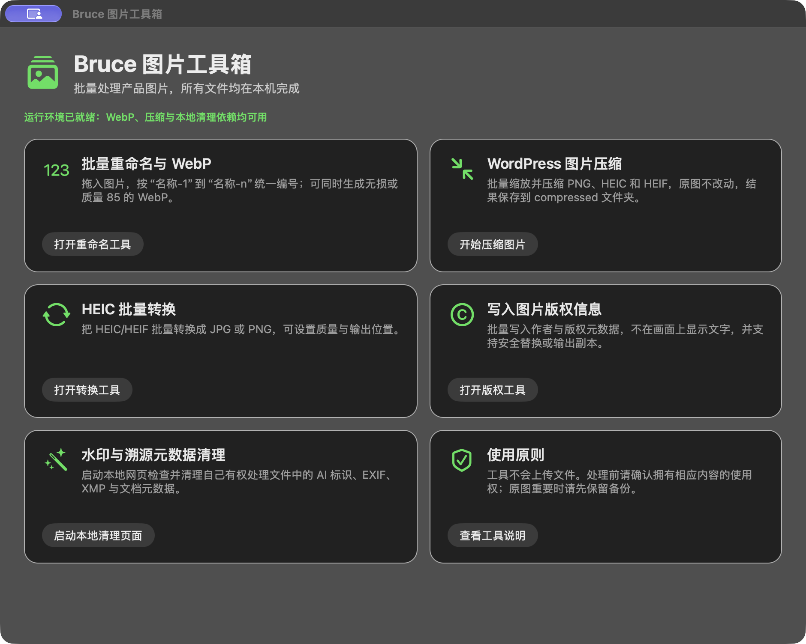

<p align="center">
  
</p>

# Bruce 图片工具箱

[](LICENSE)


一个本地运行的 macOS 图片批处理工具箱，把常用的重命名、WebP 转换、网页图片压缩、HEIC 转换、版权元数据写入和文件溯源信息检查集中到一个入口。

Bruce Image Toolbox is a local-first macOS utility that brings common image-processing workflows into one desktop launcher. Files stay on your Mac unless you explicitly move them elsewhere.

<p align="center">
  
</p>

## 功能

| 功能 | 说明 | 输出策略 |
|---|---|---|
| 批量重命名与 WebP | 按 `名称-1` 到 `名称-n` 自然排序编号，可生成无损或质量 85 的 WebP | WebP 写入原目录下的 `webp` 文件夹 |
| WordPress 图片压缩 | 缩放并压缩 PNG、HEIC、HEIF，适合网站上传 | 原图不修改，结果写入 `compressed` 文件夹 |
| HEIC 批量转换 | HEIC/HEIF 转 JPG 或 PNG，可设置质量和输出位置 | 自动避开同名文件 |
| 版权信息写入 | 写入 Creator、Rights、Description、Credit、Copyright 等元数据 | 支持安全替换或输出副本 |
| 水印与溯源元数据清理 | 本地检查并清理授权文件中的常见 AI 标识、EXIF、XMP 与文档属性 | 本地网页处理，可批量下载结果 |

## 系统要求

- macOS 13 或更高版本
- Xcode Command Line Tools / Swift 编译器
- [Homebrew](https://brew.sh/)
- 以下本地依赖：

```bash
brew install webp imagemagick pngquant
```

水印与溯源元数据模块使用 macOS 自带或本机已安装的 Python 3，仅在 `127.0.0.1` 启动本地服务。

## 构建

```bash
git clone https://github.com/Bruce-CHN-LY/bruce-image-toolbox.git
cd bruce-image-toolbox
chmod +x build-app.sh tests/verify-bundle.sh
./build-app.sh
./tests/verify-bundle.sh
./tests/smoke-test.sh
```

构建结果：

```text
Bruce 图片工具箱.app
```

三个原生子工具都会由 `build-app.sh` 从 `components/` 中的 Swift 源码重新编译，而不是依赖预构建二进制文件。

## 使用

1. 双击 `Bruce 图片工具箱.app`。
2. 从首页选择需要的处理功能。
3. 按各模块提示拖入图片或选择文件夹。
4. 第一次打开未经 Apple 公证的本地构建时，可在 Finder 中右键应用并选择“打开”。

水印与溯源元数据模块第一次启动时会复制到：

```text
~/Library/Application Support/Bruce Image Toolbox/WatermarkTool-v1
```

这样运行时产生的临时文件不会修改已签名的应用包。

## 项目结构

```text
.
├── BruceImageToolbox.swift           # AppKit 统一入口
├── components/
│   ├── image-batch-renamer/          # 重命名与 WebP
│   ├── heic-batch-converter/         # HEIC/HEIF 转换
│   └── copyright-metadata/           # 版权元数据写入
├── vendor/
│   ├── scripts/                      # WordPress 图片压缩脚本
│   └── watermark-tool/               # 本地水印/溯源检查服务
├── assets/                           # README 配图
├── tests/verify-bundle.sh            # 签名、资源与依赖自检
└── build-app.sh                      # 一键构建
```

## 隐私与合规

- 所有默认处理都在本机完成，不会主动上传文件。
- 水印与溯源元数据清理功能仅用于你自己创建、拥有或已获授权处理的内容。
- 请勿用本项目移除他人的版权管理信息、规避平台规则、伪造内容来源或实施其他违法行为。
- 清理结果不保证通过任何厂商、平台或监管机构的检测。
- 图片元数据可能被社交平台再次删除，因此重要文件应保留本地原始副本。

## 第三方组件

水印检查与清理模块参考并内置了 MIT 许可的 [`guillaumemeyer/watermarks-remover`](https://github.com/guillaumemeyer/watermarks-remover)。详细归属信息见 [THIRD_PARTY_NOTICES.md](THIRD_PARTY_NOTICES.md) 与各组件自带的许可证文件。

## License

本项目采用 [MIT License](LICENSE)。

Copyright © 2026 Bruce-CHN-LY.
